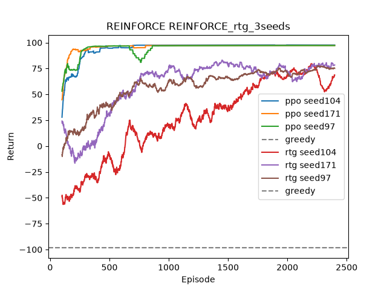

# swimmer-rl

Learning to navigate vortical flow fields with deep RL.

A fixed-speed swimmer must reach a target in a 2D Taylor–Green vortex field
with periodic boundaries. Everything is implemented from scratch in PyTorch.

Two methods were implemented: REINFORCE (built up to VPG) and PPO. 

## Result

### Taylor–Green swimmer

At `v_swim = 0.5` (swimmer half as fast as the flow), a greedy controller
that always steers toward the target **never arrives**: it gets trapped and
times out on 20/20 episodes, returning −98.5.

| Method | Return (deterministic) | Steps |
|---|---|---|
| Greedy baseline | −98.5 | 1000 (timeout) |
| VPG (learned critic) | 96.0 | 71 |
| **PPO** | **97.24 ± 0.28** | **~57** |

PPO results are the median over 3 seeds (97, 104, 171), with the standard
deviation across seeds.

*Deterministic rollouts. Blue: start. Green star: target.*

### External validation on Pendulum-v1

The PPO implementation was ported to `gymnasium` Pendulum-v1 to check that it
was not overfitted to the home-made environment. Same `train` function, only a
thin adapter around the gym API.

**−169.5 ± 3.8** (deterministic, median over 3 seeds), against a published
reference range of −150 to −200 for a correct PPO implementation.

## Implemented

### Phase 1–2: REINFORCE → VPG

REINFORCE → reward-to-go → batched updates → empirical baseline → learned
critic. Plus potential-based reward shaping, periodic domain, Gaussian policy
with state-independent `log_std` and tanh-bounded mean.

### Phase 3: PPO

Clipped surrogate objective, GAE(λ), K epochs per batch with shuffled
minibatches.

Implementation details from the
[ICLR blog post](https://iclr-blog-track.github.io/2022/03/25/ppo-implementation-details/),
each added and measured separately on 3 seeds:

| Detail | Effect measured |
|---|---|
| GAE(λ) | required |
| Clipped objective + K epochs | fixes one seed that VPG could not solve |
| Minibatches with per-epoch shuffling | first real gain on Pendulum |
| Per-minibatch advantage normalisation | neutral here |
| Entropy bonus | prevents σ collapse; coefficient is environment-dependent |
| Global gradient clipping (0.5) | neutral, kept as a safeguard |
| Linear learning-rate decay (policy **and** critic) | clear gain on both environments |
| Adam `eps = 1e-5` | within noise |
| Orthogonal init (√2 hidden, 0.01 policy head, 1 value head) | within noise |
| Observation normalisation (Welford) | neutral here; matters when observation scales are heterogeneous |
| Reward scaling | implemented, **off by default** — no gain, and assumes γ < 1 |

## Files

| File | Contents |
|---|---|
| `ppo.py` | PPO training loop + swimmer entry point |
| `pendulum.py` | gymnasium adapter + Pendulum entry point |
| `policy.py` | Gaussian policy (MLP 2×64, tanh) |
| `value.py` | Critic |
| `env.py` | Taylor–Green swimmer environment |
| `evaluate.py` | Stochastic and deterministic evaluation |
| `greedy.py` | Greedy baseline controller |

## References

- Schulman et al., *Proximal Policy Optimization Algorithms*, arXiv:1707.06347
- Schulman et al., *High-Dimensional Continuous Control Using GAE*, arXiv:1506.02438
- Huang et al., *The 37 Implementation Details of Proximal Policy Optimization*, ICLR Blog Track 2022
- Andrychowicz et al., *What Matters in On-Policy Reinforcement Learning?*, arXiv:2102.10536
- Henderson et al., *Deep Reinforcement Learning That Matters*, arXiv:1709.06560
- Gunnarson et al., *Learning efficient navigation in vortical flow fields*,
  Nature Communications 12, 7143 (2021)
