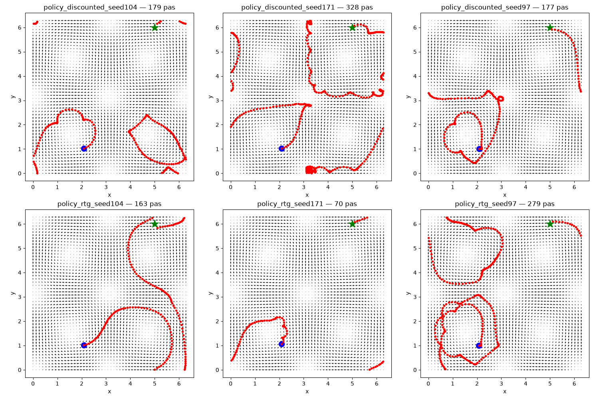

# swimmer-rl

Learning to navigate vortical flow fields with deep RL.

A fixed-speed swimmer must reach a target in a 2D Taylor–Green vortex field
with periodic boundaries. Everything is implemented from scratch in PyTorch.

## Result

At `v_swim = 0.5` (swimmer half as fast as the flow), a greedy controller
that always steers toward the target **never arrives**: it gets trapped and
times out on 20/20 episodes.

The learned policies reach the target on **6/6 runs**, best in 70 steps.

*Six trained policies (3 seeds × 2 advantage variants), deterministic rollout.
Blue: start. Green star: target. 

## Implemented

REINFORCE → reward-to-go → batched updates → empirical baseline → learned
critic (VPG). Plus potential-based reward shaping, periodic domain,
Gaussian policy.

Next steps: PPO ;)
